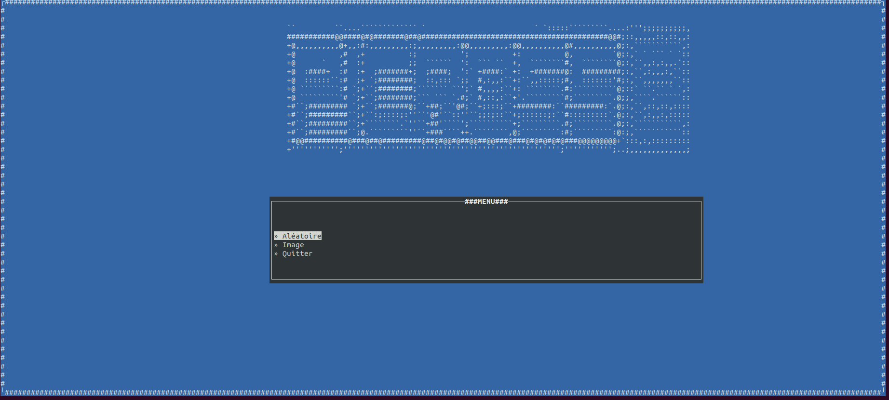
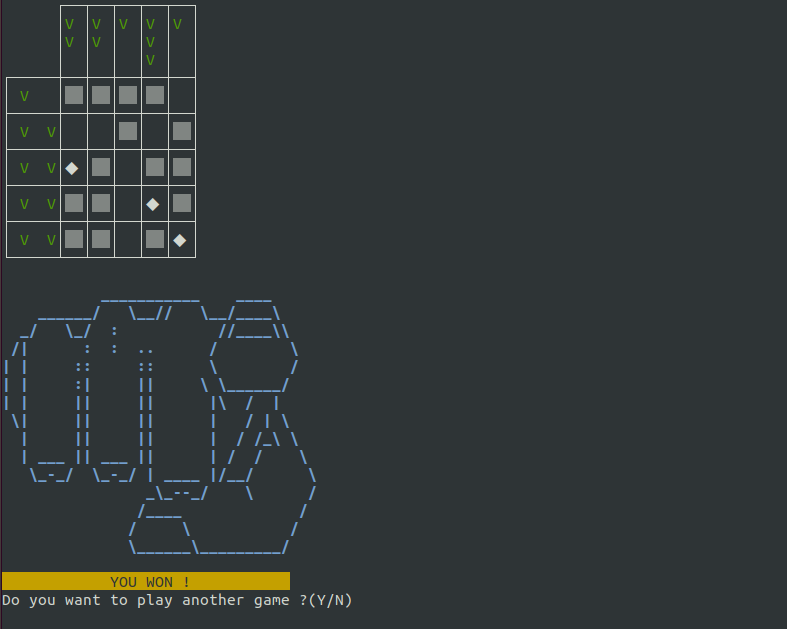

# Picross/Hanjie /w Ncurses & Sox Librairies
---
## Author: Raphael Dray.
---
> This program is a game, a [Picross/Hanjie](https://fr.wikipedia.org/wiki/Picross).
> It can be open in **terminal** using **Ncurses & Sox(Sound Player Librairie) Librairies**.

> It's written in __C language and Ncurses & Sox Librairies__.
> It's for an engineering school **1st year project C using a new Librairie (Ncurses)**.

---
### The main menu:

### In-game:

	 
---
### [READ THE LICENSE](https://github.com/MrrRaph/Picross/blob/master/LICENSE.md)
